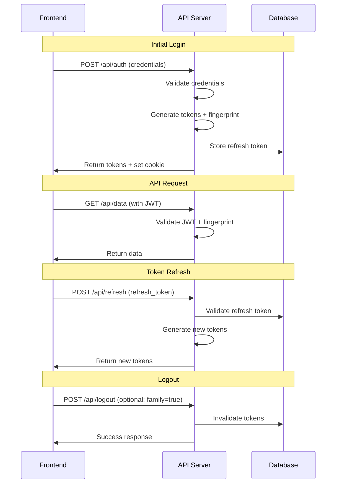

# Frontend Authentication Guide

This guide explains how to integrate frontend applications with the Rust JWT Framework's authentication system, including refresh tokens and session management.

## Table of Contents

- [Overview](#overview)
- [Authentication Flow](#authentication-flow)
- [Token Storage](#token-storage)
- [Login Implementation](#login-implementation)
- [Token Refresh](#token-refresh)
- [Logout Handling](#logout-handling)
- [Error Handling](#error-handling)
- [Framework Examples](#framework-examples)
- [Security Best Practices](#security-best-practices)
- [Troubleshooting](#troubleshooting)

## Overview

The authentication system provides:

- **JWT Access Tokens**: Short-lived tokens for API authentication
- **Refresh Tokens**: Long-lived tokens for seamless session renewal
- **Token Families**: Group related tokens for bulk invalidation
- **Fingerprinting**: Device-specific session binding
- **Automatic Refresh**: Background token renewal

### Key Features

- **Secure Storage**: HttpOnly cookies for fingerprinting
- **Token Rotation**: Optional refresh token rotation
- **Family Logout**: Invalidate single or all sessions
- **Cross-Device**: Different devices get unique sessions
- **Expiration**: Automatic token cleanup

## Authentication Flow



## Token Storage

### Recommended Storage Strategy

Following OWASP guidelines and the existing JWT documentation, we recommend:

```javascript
// Use sessionStorage for tokens (OWASP recommended)
export function getJwtToken() {
    return sessionStorage.getItem("jwt");
}

export function setJwtToken(token) {
    sessionStorage.setItem("jwt", token);
}

export function getRefreshToken() {
    return sessionStorage.getItem("refreshToken");
}

export function setRefreshToken(token) {
    sessionStorage.setItem("refreshToken", token);
}

// Fingerprint is automatically stored in HttpOnly cookie
// by the server during login
```

### Storage Options

| Method | Access Token | Refresh Token | Security | Persistence | OWASP Recommended |
|--------|-------------|---------------|----------|-------------|-------------------|
| Memory | ✅ | ❌ | 🔒 High | Session only | ❌ (lost on refresh) |
| localStorage | ❌ | ❌ | 🔓 Low | Persistent | ❌ (XSS vulnerable) |
| sessionStorage | ✅ | ✅ | 🔓 Medium | Tab only | ✅ (recommended) |
| HttpOnly Cookie | ❌ | ✅ | 🔒 High | Configurable | ✅ (for refresh tokens) |

### Why sessionStorage for Tokens?

Following the existing JWT documentation and OWASP guidelines:

- **OWASP Compliant**: Recommended in [OWASP JWT Cheatsheet](https://github.com/OWASP/CheatSheetSeries/blob/master/cheatsheets/JSON_Web_Token_for_Java_Cheat_Sheet.md)
- **XSS Protection**: With fingerprinting, stolen tokens are useless
- **Automatic Cleanup**: Lost when browser tab closes
- **Cross-Tab Sync**: Can be synchronized across tabs
- **CSP Compatible**: Works with Content Security Policy

## Login Implementation

### Basic Login Flow

```javascript
class AuthService {
  async login(email, password) {
    try {
      const response = await fetch('/api/auth', {
        method: 'POST',
        headers: {
          'Content-Type': 'application/json',
        },
        credentials: 'include', // Important for cookies
        body: JSON.stringify({ email, password })
      });

      if (!response.ok) {
        throw new Error('Login failed');
      }

      const data = await response.json();

      // Store tokens in sessionStorage (OWASP recommended)
      setJwtToken(data.token);
      setRefreshToken(data.refresh_token);
      this.familyId = data.family_id;

      // Set up automatic refresh
      this.startTokenRefresh();

      return data;
    } catch (error) {
      console.error('Login error:', error);
      throw error;
    }
  }
}
```

### Login Response Structure

```json
{
  "success": true,
  "data": {
    "token": "eyJ0eXAiOiJKV1QiLCJhbGciOiJIUzI1NiJ9...",
    "iat": 1640995200,
    "exp": 1640998800,
    "refresh_token": "refresh_token_here",
    "family_id": "uuid-family-id"
  }
}
```

### Cookie Handling

The server automatically sets:
- **HttpOnly Cookie**: `recog=<fingerprint>`
- **Secure**: Only sent over HTTPS
- **SameSite**: Prevents CSRF attacks
- **Max-Age**: 30 days (configurable)

## Token Refresh

### Automatic Token Refresh

```javascript
class AuthService {
  constructor() {
    this.refreshPromise = null;
    this.isRefreshing = false;
    this.refreshTimer = null;
  }

  startTokenRefresh() {
    // Clear any existing timer
    if (this.refreshTimer) {
      clearTimeout(this.refreshTimer);
    }

    // Refresh 5 minutes before expiration
    const refreshTime = (this.getTokenExpiration() - Date.now()) - (5 * 60 * 1000);

    if (refreshTime > 0) {
      this.refreshTimer = setTimeout(() => this.refreshToken(), refreshTime);
    }
  }

  async refreshToken() {
    if (this.isRefreshing) {
      return this.refreshPromise;
    }

    this.isRefreshing = true;

    try {
      this.refreshPromise = this.performTokenRefresh();
      const data = await this.refreshPromise;

      // Update tokens in sessionStorage
      setJwtToken(data.token);
      if (data.refresh_token) {
        setRefreshToken(data.refresh_token);
      }

      // Schedule next refresh
      this.startTokenRefresh();

      return data;
    } finally {
      this.isRefreshing = false;
      this.refreshPromise = null;
    }
  }

  async performTokenRefresh() {
    const refreshToken = getRefreshToken();

    if (!refreshToken) {
      throw new Error('No refresh token available');
    }

    const response = await fetch('/api/refresh', {
      method: 'POST',
      headers: {
        'Content-Type': 'application/json',
      },
      credentials: 'include',
      body: JSON.stringify({
        refresh_token: refreshToken
      })
    });

    if (!response.ok) {
      // If refresh fails, clear tokens and redirect to login
      this.clearTokens();
      window.location.href = '/login';
      throw new Error('Token refresh failed');
    }

    return response.json();
  }

  getTokenExpiration() {
    const token = getJwtToken();
    if (!token) return 0;

    try {
      const payload = JSON.parse(atob(token.split('.')[1]));
      return payload.exp * 1000; // Convert to milliseconds
    } catch {
      return 0;
    }
  }

  clearTokens() {
    sessionStorage.removeItem('jwt');
    sessionStorage.removeItem('refreshToken');

    if (this.refreshTimer) {
      clearTimeout(this.refreshTimer);
      this.refreshTimer = null;
    }
  }
}
```

### Manual Token Refresh

```javascript
// Refresh token manually
const newTokens = await authService.refreshToken();
console.log('Tokens refreshed:', newTokens);
```

### Cross-Tab Synchronization

Following the existing JWT documentation patterns, you can synchronize authentication state across browser tabs:

```javascript
class AuthService {
  constructor() {
    this.setupCrossTabSync();
  }

  setupCrossTabSync() {
    // Listen for logout events from other tabs
    window.addEventListener('storage', (event) => {
      if (event.key === 'logout') {
        console.log('Logged out from another tab');
        this.clearTokens();
        window.location.href = '/login';
      }
    });
  }

  logout() {
    // Clear local tokens
    this.clearTokens();

    // Notify other tabs
    localStorage.setItem('logout', Date.now().toString());
    localStorage.removeItem('logout');

    // Call server logout
    return this.performServerLogout();
  }

  // Sync sessionStorage across tabs (from existing JWT docs)
  syncSessionStorage() {
    if (!sessionStorage.length) {
      // Ask other tabs for session storage
      localStorage.setItem('getSessionStorage', Date.now().toString());
    }

    window.addEventListener('storage', (event) => {
      if (event.key === 'getSessionStorage') {
        // Some tab asked for sessionStorage -> send it
        localStorage.setItem('sessionStorage', JSON.stringify(sessionStorage));
        localStorage.removeItem('sessionStorage');
      } else if (event.key === 'sessionStorage' && !sessionStorage.length) {
        // sessionStorage is empty -> fill it
        const data = JSON.parse(event.newValue);
        for (let key in data) {
          sessionStorage.setItem(key, data[key]);
        }
      }
    });
  }
}
```

### Refresh Response Structure

```json
{
  "success": true,
  "data": {
    "token": "new_access_token_here",
    "iat": 1640995200,
    "exp": 1640998800,
    "refresh_token": "new_refresh_token_here" // if rotation enabled
  }
}
```

## Logout Handling

### Single Session Logout

```javascript
async logout() {
  try {
    const response = await fetch('/api/logout', {
      method: 'POST',
      headers: {
        'Content-Type': 'application/json',
      },
      credentials: 'include',
      body: JSON.stringify({
        refresh_token: this.refreshToken
      })
    });

    if (response.ok) {
      this.clearTokens();
    }
  } catch (error) {
    console.error('Logout error:', error);
    // Still clear tokens locally
    this.clearTokens();
  }
}
```

### Family Logout (All Sessions)

```javascript
async logoutAllSessions() {
  try {
    const response = await fetch('/api/logout', {
      method: 'POST',
      headers: {
        'Content-Type': 'application/json',
      },
      credentials: 'include',
      body: JSON.stringify({
        refresh_token: this.refreshToken,
        logout_family: true
      })
    });

    if (response.ok) {
      this.clearTokens();
      // Optionally redirect to login
      window.location.href = '/login';
    }
  } catch (error) {
    console.error('Family logout error:', error);
    this.clearTokens();
  }
}
```

### Token Cleanup

```javascript
clearTokens() {
  // Clear tokens from sessionStorage
  sessionStorage.removeItem('jwt');
  sessionStorage.removeItem('refreshToken');

  // Clear any refresh timers
  if (this.refreshTimer) {
    clearTimeout(this.refreshTimer);
    this.refreshTimer = null;
  }

  // Reset refresh state
  this.isRefreshing = false;
  this.refreshPromise = null;
}
```

## Error Handling

### HTTP Status Code Handling

The API now returns semantic HTTP status codes for better REST compliance:

- **`200 OK`** - Successful operations (queries, updates, authentication)
- **`201 Created`** - Successful resource creation (user registration, policy creation)
- **`400 Bad Request`** - Validation errors or malformed requests
- **`401 Unauthorized`** - Authentication required or invalid credentials
- **`403 Forbidden`** - Insufficient permissions or access denied
- **`404 Not Found`** - Resource or endpoint not found
- **`500 Internal Server Error`** - Server-side errors

### Authentication Errors

```javascript
class AuthService {
  async handleApiError(error, retry = true) {
    if (error.status === 401) {
      if (retry && getRefreshToken()) {
        try {
          await this.refreshToken();
          // Retry the original request
          return this.retryOriginalRequest();
        } catch (refreshError) {
          // Refresh failed, redirect to login
          this.redirectToLogin();
        }
      } else {
        this.redirectToLogin();
      }
    }

    throw error;
  }

  redirectToLogin() {
    this.clearTokens();
    window.location.href = '/login';
  }

  async retryOriginalRequest() {
    // This would need to be implemented based on your specific needs
    // For example, you could store the failed request and retry it
    console.log('Retrying original request with new token');
  }
}
```

### Network Error Handling

```javascript
async makeAuthenticatedRequest(url, options = {}) {
  const token = getJwtToken();
  const config = {
    ...options,
    headers: {
      ...options.headers,
      ...(token && { 'Authorization': `Bearer ${token}` }),
    },
    credentials: 'include',
  };

  try {
    const response = await fetch(url, config);

    if (response.status === 401 && getRefreshToken()) {
      // Token expired, try refresh
      await this.handleApiError({ status: 401 });
      // Retry with new token
      const newToken = getJwtToken();
      if (newToken) {
        config.headers['Authorization'] = `Bearer ${newToken}`;
        return fetch(url, config);
      }
    }

    return response;
  } catch (error) {
    if (!navigator.onLine) {
      // Handle offline state
      throw new Error('No internet connection');
    }

    throw error;
  }
}
```

## Framework Examples

### React with Hooks

```javascript
import { createContext, useContext, useState, useEffect } from 'react';

const AuthContext = createContext();

export function AuthProvider({ children }) {
  const [user, setUser] = useState(null);
  const [loading, setLoading] = useState(true);

  useEffect(() => {
    checkAuthStatus();
  }, []);

  const checkAuthStatus = async () => {
    try {
      const response = await fetch('/api/profile', {
        credentials: 'include'
      });

      if (response.ok) {
        const userData = await response.json();
        setUser(userData.data);
      }
    } catch (error) {
      console.error('Auth check failed:', error);
    } finally {
      setLoading(false);
    }
  };

  const login = async (email, password) => {
    const response = await fetch('/api/auth', {
      method: 'POST',
      headers: { 'Content-Type': 'application/json' },
      credentials: 'include',
      body: JSON.stringify({ email, password })
    });

    if (response.ok) {
      const data = await response.json();
      setUser({ email }); // Set basic user info
      return data;
    }

    throw new Error('Login failed');
  };

  const logout = async () => {
    await fetch('/api/logout', {
      method: 'POST',
      credentials: 'include'
    });
    setUser(null);
  };

  return (
    <AuthContext.Provider value={{ user, login, logout, loading }}>
      {children}
    </AuthContext.Provider>
  );
}

export function useAuth() {
  return useContext(AuthContext);
}
```

### Vue.js Composition API

```javascript
import { ref, computed, onMounted } from 'vue';
import { useRouter } from 'vue-router';

export function useAuth() {
  const user = ref(null);
  const loading = ref(true);
  const router = useRouter();

  const isAuthenticated = computed(() => !!user.value);

  const login = async (email, password) => {
    try {
      const response = await fetch('/api/auth', {
        method: 'POST',
        headers: { 'Content-Type': 'application/json' },
        credentials: 'include',
        body: JSON.stringify({ email, password })
      });

      if (!response.ok) {
        throw new Error('Login failed');
      }

      const data = await response.json();
      user.value = { email };
      router.push('/dashboard');

      return data;
    } catch (error) {
      throw error;
    }
  };

  const logout = async () => {
    try {
      await fetch('/api/logout', {
        method: 'POST',
        credentials: 'include'
      });
    } finally {
      user.value = null;
      router.push('/login');
    }
  };

  const checkAuth = async () => {
    try {
      const response = await fetch('/api/profile', {
        credentials: 'include'
      });

      if (response.ok) {
        const data = await response.json();
        user.value = data.data;
      }
    } catch (error) {
      console.error('Auth check failed:', error);
    } finally {
      loading.value = false;
    }
  };

  onMounted(() => {
    checkAuth();
  });

  return {
    user,
    loading,
    isAuthenticated,
    login,
    logout,
    checkAuth
  };
}
```

### Angular Service

```typescript
import { Injectable } from '@angular/core';
import { HttpClient, HttpErrorResponse } from '@angular/common/http';
import { BehaviorSubject, Observable, throwError } from 'rxjs';
import { catchError, tap } from 'rxjs/operators';
import { Router } from '@angular/router';

interface User {
  id: string;
  email: string;
  username: string;
  first_name: string;
  last_name: string;
  role: string;
}

interface AuthResponse {
  token: string;
  iat: number;
  exp: number;
  refresh_token: string;
  family_id: string;
}

@Injectable({
  providedIn: 'root'
})
export class AuthService {
  private userSubject = new BehaviorSubject<User | null>(null);
  public user$ = this.userSubject.asObservable();

  constructor(
    private http: HttpClient,
    private router: Router
  ) {
    this.checkAuthStatus();
  }

  login(email: string, password: string): Observable<AuthResponse> {
    return this.http.post<AuthResponse>('/api/auth', { email, password }, {
      withCredentials: true
    }).pipe(
      tap(response => {
        // Store tokens in sessionStorage (OWASP recommended)
        sessionStorage.setItem('jwt', response.token);
        sessionStorage.setItem('refreshToken', response.refresh_token);
        this.userSubject.next({ email } as User);
        this.startTokenRefresh(response.exp);
      }),
      catchError(this.handleError.bind(this))
    );
  }

  logout(): Observable<any> {
    return this.http.post('/api/logout', {}, {
      withCredentials: true
    }).pipe(
      tap(() => {
        this.clearTokens();
        this.userSubject.next(null);
        this.router.navigate(['/login']);
      }),
      catchError(this.handleError.bind(this))
    );
  }

  refreshToken(): Observable<AuthResponse> {
    const refreshToken = sessionStorage.getItem('refreshToken');

    return this.http.post<AuthResponse>('/api/refresh', {
      refresh_token: refreshToken
    }, {
      withCredentials: true
    }).pipe(
      tap(response => {
        sessionStorage.setItem('jwt', response.token);
        if (response.refresh_token) {
          sessionStorage.setItem('refreshToken', response.refresh_token);
        }
        this.startTokenRefresh(response.exp);
      }),
      catchError(error => {
        if (error.status === 401) {
          this.logout();
        }
        return throwError(error);
      })
    );
  }

  private checkAuthStatus(): void {
    this.http.get<{ data: User }>('/api/profile', {
      withCredentials: true
    }).subscribe({
      next: (response) => {
        this.userSubject.next(response.data);
      },
      error: () => {
        this.userSubject.next(null);
      }
    });
  }

  private startTokenRefresh(expirationTime: number): void {
    const refreshTime = (expirationTime * 1000) - Date.now() - (5 * 60 * 1000);

    if (refreshTime > 0) {
      setTimeout(() => {
        this.refreshToken().subscribe();
      }, refreshTime);
    }
  }

  private clearTokens(): void {
    sessionStorage.removeItem('jwt');
    sessionStorage.removeItem('refreshToken');
  }

  private handleError(error: HttpErrorResponse) {
    if (error.status === 401) {
      this.clearTokens();
      this.userSubject.next(null);
      this.router.navigate(['/login']);
    }

    return throwError(() => error);
  }
}
```

### Apollo GraphQL Integration

For GraphQL applications using Apollo Client, follow the patterns from the existing JWT documentation:

```javascript
import { useMemo } from "react";
import { ApolloClient, InMemoryCache, HttpLink, ApolloLink } from "@apollo/client";
import { onError } from 'apollo-link-error';

function getHeaders() {
  const headers = {};
  const token = sessionStorage.getItem('jwt');
  if (token) headers["Authorization"] = `Bearer ${token}`;
  return headers;
}

function createApolloClient() {
  const httpLink = new HttpLink({
    uri: '/graphql',
    credentials: "include",
  });

  const authLink = new ApolloLink((operation, forward) => {
    operation.setContext(({ headers = {} }) => ({
      headers: {
        ...headers,
        ...getHeaders(),
      },
    }));
    return forward(operation);
  });

  const logoutLink = onError(({ networkError }) => {
    if (networkError?.statusCode === 401) {
      // Token expired, trigger logout
      sessionStorage.removeItem('jwt');
      sessionStorage.removeItem('refreshToken');
      window.location.href = '/login';
    }
  });

  return new ApolloClient({
    link: ApolloLink.from([logoutLink, authLink, httpLink]),
    cache: new InMemoryCache(),
  });
}
```

## Security Best Practices

### Token Storage

```javascript
// ✅ DO: Store tokens in sessionStorage (OWASP recommended)
export function setJwtToken(token) {
  sessionStorage.setItem('jwt', token);
}

export function getJwtToken() {
  return sessionStorage.getItem('jwt');
}

// ❌ DON'T: Store sensitive tokens in localStorage
// localStorage.setItem('jwt', token); // Not recommended

// ✅ DO: Use HttpOnly cookies for refresh tokens (handled by server)
// ✅ DO: Clear tokens on logout
export function clearTokens() {
  sessionStorage.removeItem('jwt');
  sessionStorage.removeItem('refreshToken');
}
```

### Request Interceptors

```javascript
// Add authorization header to all requests
const originalFetch = window.fetch;
window.fetch = async function(...args) {
  const [url, config = {}] = args;

  // Add auth header for API requests
  const token = getJwtToken();
  if (url.startsWith('/api/') && token) {
    config.headers = {
      ...config.headers,
      'Authorization': `Bearer ${token}`
    };
  }

  // Include credentials for cookie handling
  config.credentials = 'include';

  try {
    const response = await originalFetch(url, config);

    // Handle 401 responses
    if (response.status === 401 && getRefreshToken()) {
      // Try to refresh token
      try {
        await authService.refreshToken();
        // Retry with new token
        const newToken = getJwtToken();
        if (newToken) {
          config.headers['Authorization'] = `Bearer ${newToken}`;
          return originalFetch(url, config);
        }
      } catch (refreshError) {
        // Refresh failed, redirect to login
        window.location.href = '/login';
      }
    }

    return response;
  } catch (error) {
    throw error;
  }
};
```

### CSRF Protection

```javascript
// The system uses SameSite cookies and HttpOnly flags
// Additional CSRF protection can be added if needed

const csrfToken = await fetch('/api/csrf-token', {
  credentials: 'include'
}).then(r => r.text());

const response = await fetch('/api/data', {
  method: 'POST',
  headers: {
    'X-CSRF-Token': csrfToken,
    'Content-Type': 'application/json'
  },
  credentials: 'include',
  body: JSON.stringify(data)
});
```

### Persisting Sessions

Following OWASP guidelines from the existing JWT documentation:

**⚠️ Important Security Note**: Persistent sessions across browser restarts are **not recommended** by OWASP:

> _"Retrieved even if the browser is restarted (Use of browser localStorage container)"_

However, if you need persistent sessions, consider these approaches:

#### Option 1: localStorage (Not Recommended)
```javascript
// ❌ NOT recommended by OWASP for sensitive tokens
export function persistTokens(token, refreshToken) {
  localStorage.setItem('jwt', token);
  localStorage.setItem('refreshToken', refreshToken);
}

export function loadPersistedTokens() {
  return {
    token: localStorage.getItem('jwt'),
    refreshToken: localStorage.getItem('refreshToken')
  };
}

// ⚠️ WARNING: localStorage is vulnerable to XSS attacks
// Only use if you have strong CSP and input validation
```

#### Option 2: HttpOnly Cookies (Recommended for Persistence)
```javascript
// ✅ Recommended: Let server handle persistence via HttpOnly cookies
// The refresh token cookie set by server provides persistence
// Access tokens remain in sessionStorage for security
```

#### Option 3: Hybrid Approach (Recommended)
```javascript
export function initializeAuth() {
  // Try to restore from sessionStorage refresh token
  const refreshToken = getRefreshToken();

  if (refreshToken) {
    // Attempt to refresh on app startup to validate tokens
    authService.refreshToken().catch(() => {
      // If refresh fails, clear invalid tokens
      clearTokens();
      console.log('Invalid tokens cleared on app startup');
    });
  }
}

// Initialize auth when app starts
document.addEventListener('DOMContentLoaded', () => {
  initializeAuth();
});
```

### Secure Headers

Ensure your server sets appropriate security headers:

```javascript
// Server should set these headers
res.setHeader('X-Content-Type-Options', 'nosniff');
res.setHeader('X-Frame-Options', 'DENY');
res.setHeader('X-XSS-Protection', '1; mode=block');
res.setHeader('Strict-Transport-Security', 'max-age=31536000; includeSubDomains');
res.setHeader('Content-Security-Policy', "default-src 'self'");
```

## Troubleshooting

### Common Issues

#### 1. Cookies Not Being Sent

**Problem**: Fingerprint cookie not included in requests

**Solution**:
```javascript
// Ensure credentials: 'include' on all requests
fetch('/api/data', {
  credentials: 'include'  // This is crucial
});
```

#### 2. Token Refresh Failing

**Problem**: Refresh requests return 401

**Solutions**:
- Check if refresh token is expired
- Verify cookie is being sent
- Ensure correct Content-Type header
- Check server logs for validation errors

#### 3. Multiple Concurrent Refreshes

**Problem**: Race conditions during token refresh

**Solution**: Use a refresh promise to prevent concurrent refreshes

```javascript
async refreshToken() {
  if (this.isRefreshing) {
    return this.refreshPromise;
  }

  this.isRefreshing = true;
  this.refreshPromise = this.performRefresh();

  try {
    return await this.refreshPromise;
  } finally {
    this.isRefreshing = false;
    this.refreshPromise = null;
  }
}
```

#### 4. Token Expiration Issues

**Problem**: Tokens expire before refresh

**Solution**: Refresh earlier (e.g., 5 minutes before expiration)

```javascript
const refreshTime = (expirationTime - Date.now()) - (5 * 60 * 1000);
```

### Debug Logging

```javascript
class AuthService {
  constructor() {
    this.debug = process.env.NODE_ENV === 'development';
  }

  log(message, data) {
    if (this.debug) {
      console.log(`[Auth] ${message}`, data);
    }
  }

  async login(email, password) {
    this.log('Starting login', { email });

    const response = await fetch('/api/auth', {
      method: 'POST',
      headers: { 'Content-Type': 'application/json' },
      credentials: 'include',
      body: JSON.stringify({ email, password })
    });

    if (response.ok) {
      const data = await response.json();
      setJwtToken(data.token);
      setRefreshToken(data.refresh_token);

      this.log('Login successful', {
        hasToken: !!getJwtToken(),
        familyId: data.family_id
      });
    }

    return response;
  }

  async refreshToken() {
    this.log('Starting token refresh');

    const result = await this.performTokenRefresh();

    this.log('Token refresh completed', {
      hasNewToken: !!getJwtToken(),
      hasNewRefreshToken: !!getRefreshToken()
    });

    return result;
  }
}
```

### Health Checks

```javascript
// Check if authentication is working
async checkAuthHealth() {
  try {
    const response = await fetch('/api/health', {
      credentials: 'include'
    });

    if (response.ok) {
      console.log('✅ Auth system healthy');
      return true;
    } else {
      console.error('❌ Auth system unhealthy');
      return false;
    }
  } catch (error) {
    console.error('❌ Auth health check failed:', error);
    return false;
  }
}
```

## Configuration

### Environment Variables

```bash
# Access token expiration (in minutes)
JWT_TTL_IN_MINUTES=30

# Refresh token expiration (in days)
REFRESH_TOKEN_TTL_DAYS=30

# Enable token rotation
REFRESH_TOKEN_ROTATION=true

# Enable family-based logout
REFRESH_TOKEN_FAMILY_LOGOUT=true
```

### Client Configuration

```javascript
const config = {
  apiBaseUrl: '/api',
  tokenRefreshThreshold: 5 * 60 * 1000, // 5 minutes
  maxRetryAttempts: 3,
  retryDelay: 1000, // 1 second
  debug: process.env.NODE_ENV === 'development'
};
```

## References

- [OWASP JWT Cheatsheet](https://github.com/OWASP/CheatSheetSeries/blob/master/cheatsheets/JSON_Web_Token_for_Java_Cheat_Sheet.md)
- [OWASP Application Security Verification Standard](https://github.com/OWASP/ASVS)
- [Existing JWT Documentation](./jwt.md) - Original JWT implementation guide
- [JWT.io](https://jwt.io/) - JWT standard and debugger
- [SameSite Cookies](https://web.dev/samesite-cookies-explained/) - CSRF protection
- [Content Security Policy](https://developer.mozilla.org/en-US/docs/Web/HTTP/CSP) - XSS protection

## Related Documentation

- [JWT Implementation](./jwt.md) - Original JWT guide with GraphQL focus
- [JWT Fingerprinting](./jwt-fingerprinting-implementation.md) - Server-side fingerprinting
- [In-Memory JWT Fingerprinting](./in-memory-jwt-fingerprinting.md) - Memory-based fingerprinting
- [Redis JWT Fingerprinting](./redis/redis-jwt-fingerprinting.md) - Redis-based fingerprinting

## Changelog

- **v1.0** - Initial implementation with refresh tokens and family tracking
- Aligned with existing JWT documentation patterns
- Added comprehensive framework examples
- Included OWASP security recommendations

---

This comprehensive guide covers all aspects of integrating frontend applications with the Rust JWT Framework's authentication system. Follow these patterns to ensure secure, reliable authentication in your applications.